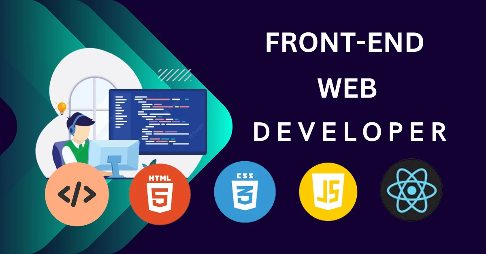
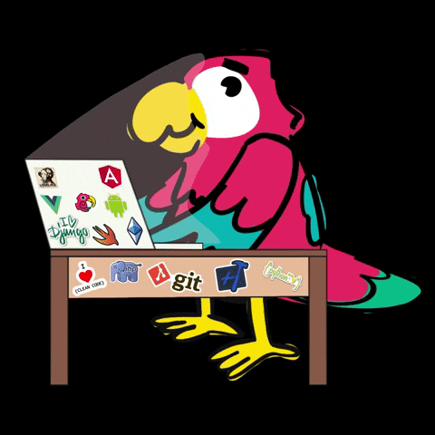
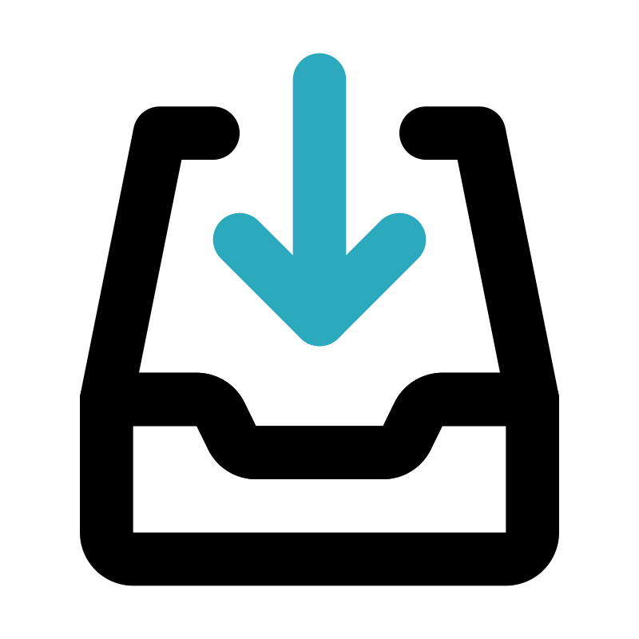

<!--suppress ALL -->
<h1 align="center">Hi 👋, I'm Zane Zeltina</h1>
<h3 align="center">I'm a Junior frontend developer from Latvia</h3>

  

### 👩🏻 About me:
___
* 🎓 I have gained my knowledge through self-study.
* 💻 ~ 1 - year experience as a Freelancer.
* 💼 I am looking for a part-time job. I'm open to any contracts and job offers.
* 🎓 I am finished some courses, also I have high school education.
___
### 🛠️ I have experience working with different **technologies** and **tools**:
___
💻
  - HTML (HTML5), EJS, JSX;
  - CSS (CSS3), Sass (SCSS), PostCSS, Tailwind;
  - JavaScript (ES6+, OOP);
  - React;
  - Webpack, Vite, Gulp;
  - BEM, Feature-Sliced Design, Accessibility, UX;
  - Git (GitHub, BitBucket, GitLab);
  - Figma, Adobe Photoshop, Pixso;
  - CRM, Asana, Trello, Jira, Notion;
  - PHP, Blade;
  - Agile, Waterfall, SCRUM;
  - npm, yarn, pnpm;
___
### 🔑 My soft skills:
___
  - Communication;
  - Teamwork;
  - Time management;
  - Problem solving;
  - Creativity;
  - Self-motivation;
  - Leadership;
  - Attention to detail;
  - Problem solving;
___
* 🎓 I really like learning, gaining new knowledge and skills.
* 👀 My eyes always light up when I see something new and unknown to me. Especially 
  anything related to IT.
* 💬 I communicate easily with other people, I know how to resolve disagreements.
___
### 🌎 Where You can find me:
___
- <a href="https://t.me/Zany1989" target="_blank"> Telegram</a>
- <a href="https://www.tiktok.com/@aleksanderlamkov" target="_blank"> TikTok</a>
- <a href="https://www.instagram.com/zanezeltina32/" target="_blank"> Instagram</a>
- <a href="https://www.youtube.com/@AleksanderLamkov" target="_blank"> YouTube</a>
- <a href="https://github.com/Zany1989" target="_blank"> GitHub</a>
- <a href="https://wa. me/3712909120" target="_blank"> WhatsApp</a>
- <a href="mailto:zanezeltina32@inbox.lv" target="_blank"> Email</a>
- <a href="https://discord.gg/4b2c5e3f" target="_blank"> Discord</a>
- <a href="https://stackoverflow.com/users/21370151/zany1919" target="_blank"> StackOverflow</a>
- <a href="https://x.com/ZaneZeltina35" target="_blank"> Twitter</a>
- <a href="https://www.facebook.com/aleksander.lamkov" target="_blank"> Facebook</a>
___
### 📚 What I'm currently learning:
___
- 💻 I’m currently learning at [https://www.udemy.com/](https://www.udemy.com/) and
  other **paid courses**
- 📑 Also, I'm learning by myself through **YouTube videos, articles, documentation, 
  books** and other free resources.
- 🇬🇧 I'm improving my **English language** level
___
### 🏆 I'm passed:
___
- 🎓 "Discover Tech" by: **Riga TechGirls** 2022/08–2022/11
___
###

 

### 🔖 Other:
___
- 💬 Ask me about **HTML, CSS, SCSS, Git, JS**
- 👨‍💻 All of my projects are available at [https://github.com/Zany1989](https://github.com/Zany1989)
- 📫 How to reach me: **zanezeltina32@inbox.lv**
- 📄 Know about my experiences [https://github.com/Zany1989](https://github.com/Zany1989)
___
### 🛠️ Languages and Tools:
___

                                                

___
### 🔖 My Stats:
___

